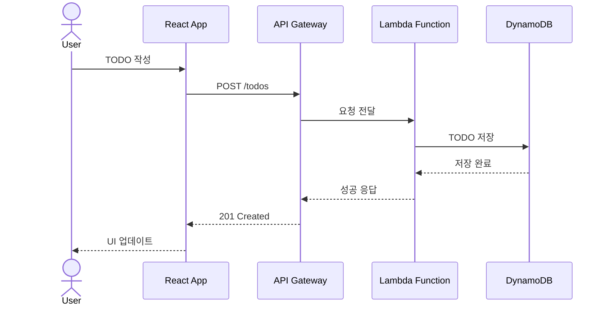
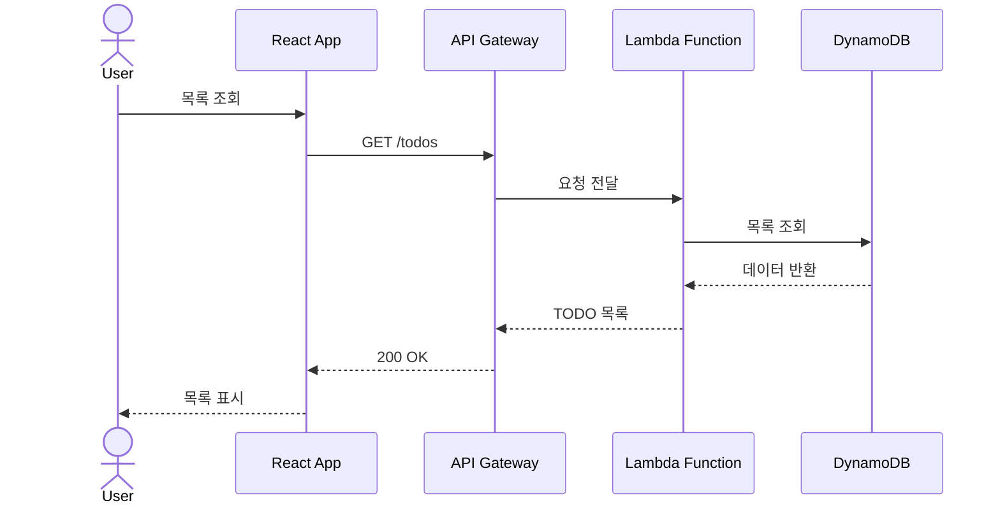
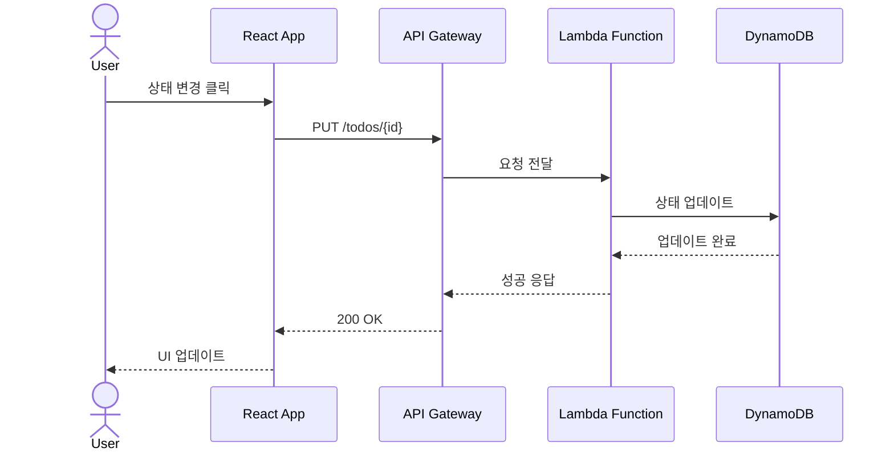

# 🚀 Modern TODO Application

현대적인 웹 기술을 활용한 서버리스 TODO 애플리케이션입니다. React와 AWS 서버리스 아키텍처를 기반으로 구축되었습니다.

## ✨ 주요 기능

- 📝 TODO 항목 생성, 읽기, 수정, 삭제 (CRUD)
- 🔍 TODO 항목 필터링 및 검색
- 📱 반응형 디자인
- ⚡ 서버리스 아키텍처로 인한 높은 확장성
- 🔒 익명 사용자 지원

## 🛠 기술 스택

### 프론트엔드
- React
- TypeScript
- Material-UI/Tailwind CSS
- GitHub Pages (호스팅)

### 백엔드
- AWS CDK (Infrastructure as Code)
- AWS Lambda
- Amazon API Gateway
- Amazon DynamoDB
- Amazon Cognito (익명 인증)

## 🏗 아키텍처

```
                                    AWS Cloud
+----------------+          +------------------------+
|                |          |                        |
|   React App    | -------> |     API Gateway       |
| (GitHub Pages) |          |                        |
|                |          +------------------------+
+----------------+                     |
                                      |
                                      v
                           +------------------------+
                           |                        |
                           |    Lambda Functions    |
                           |                        |
                           +------------------------+
                                      |
                                      |
                           +------------------------+
                           |                        |
                           |      DynamoDB         |
                           |                        |
                           +------------------------+
```

## 🚀 시작하기

### 사전 요구사항
- Node.js (v18 이상)
- AWS CLI 설정
- AWS CDK CLI
- Git

### 로컬 개발 환경 설정? Where do you use GitHub?  [Use arrows to move, type to filter]
> GitHub.com

1. 저장소 클론
```bash
git clone <repository-url>
cd wsf_demo
```

2. 프론트엔드 설정
```bash
cd frontend
npm install
npm start
```

3. 백엔드 배포
```bash
cd backend     
npm install
cdk deploy
```

## 📚 문서

자세한 내용은 다음 문서를 참조하세요:
- [설계 문서](doc/design.md)
- [TODO 리스트](doc/todo.md)

## 🔧 개발 가이드라인

### 브랜치 관리 (GitHub Flow)

GitHub Flow를 사용하여 간단하고 효율적인 브랜치 관리를 합니다.

1. 기본 원칙
   - `main` 브랜치는 항상 배포 가능한 상태를 유지
   - 새로운 작업은 `main`에서 feature 브랜치를 생성하여 진행
   - Pull Request를 통한 코드 리뷰 후 `main`에 병합
   - 병합 후 즉시 배포

2. 브랜치 명명 규칙
   - `feature/issue-숫자`: 새로운 기능 개발
   - `fix/issue-숫자`: 버그 수정
   - `docs/설명`: 문서 수정
   - `refactor/설명`: 코드 리팩토링

3. 작업 흐름
   ```mermaid
   graph TD
      A[main] -->|branch| B[feature/issue-숫자]
      B -->|commit| B
      B -->|Pull Request| C{코드 리뷰}
      C -->|승인| D[main으로 병합]
      C -->|수정 요청| B
      D -->|자동 배포| E[Production]
   ```

4. Pull Request 규칙
   - 제목: [종류] 작업 내용 요약 (예: [Feature] Todo 생성 기능 추가)
   - 본문: 작업 내용 상세 설명, 관련 이슈 번호
   - 최소 1명 이상의 리뷰어 승인 필요
   - CI 테스트 통과 필수

5. 배포 프로세스
   - main 브랜치 병합 시 자동 배포 (GitHub Actions)
   - 배포 전 자동화된 테스트 수행
   - 배포 후 모니터링 진행

2. 커밋 메시지 컨벤션
   ```
   feat: 새로운 기능
   fix: 버그 수정
   docs: 문서 수정
   style: 코드 포맷팅
   refactor: 코드 리팩토링
   test: 테스트 코드
   chore: 기타 변경사항
   ```

## 🤝 기여하기

1. Fork the Project
2. Create your Feature Branch (`git checkout -b feature/AmazingFeature`)
3. Commit your Changes (`git commit -m 'feat: Add some AmazingFeature'`)
4. Push to the Branch (`git push origin feature/AmazingFeature`)
5. Open a Pull Request

## 📔 시스템 시퀀스

### TODO 작성 및 저장


### TODO 목록 조회


### TODO 상태 변경


## 📝 라이선스

[MIT License](LICENSE)

## 👥 팀

- Frontend Developer
- Backend Developer
- DevOps Engineer

## 📞 문의

프로젝트에 대한 문의사항이 있으시면 Issue를 생성해 주세요.
